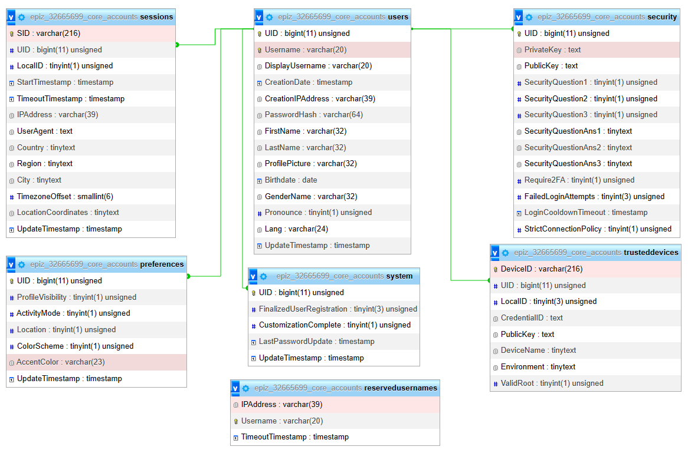

# The Ciel System (Ciel Accounts System)

This is a project that aims to provide developers with an easy-to-use third-party accounts system and provide users with a secure, reliable, and private experiance with full control over their data. (online open beta - <https://ciel-core.online>, add ***#activate-developer-mode*** to the URL for more console logs)

## Planned conditions for websites implimination

1. Developers must use the provided library, without any custom modifications to it in any way.
2. Developers must provide minimal statestics about the user
3. Developers must adhere to using the tracking functions within the provided library
4. Should the user decide to delete their account, all data related to that user must be deleted (per the user's request).
5. Should the user request a copy of their data through this accounts service, the Developer must provide a copy of the user's data within 30 days!

> Note that the user can fully control which data within the website will be collected and which data should not be shared.
**Note to myself: the data should not be transfered out of a server without checking the user's preferences first.**

## Roadmap

- [x] Add a welcome screen
- [ ] Add a sign in page
  - [x] Password login
  - [x] `WehAuthn` support (<https://try-webauthn.appspot.com/>)
  - [ ] QR/code temporary login using signed in account
  - [ ] Two-factor authentication
    - [ ] Security keys
    - [ ] Mobile prompt
    - [ ] Security code from mobile app
    - [ ] verification code from auth app (*e.g. Google/Microsoft Authenticator*)
    - [ ] Emergency backup codes
- [x] Add a sign up page (fully complete)
  - [x] Force the user to set up security questions (3 minimum)
- [ ] Add a control panel (Home page)
  - [ ] Always require the user to do device authentication/relogin when the user attempts to change important settings
  - [ ] Account quick customisation prompt
- [ ] Add an "about" section
- [ ] Add a "help" section
- [ ] Add an activity tracking system (Must be completely controlable by the user)
- [ ] Make a library/API for developers
  - [ ] Tracking functions
  - [ ] Login/Logout functions
  - [ ] Data-related requests channels (for account deletion/data copy requests)
- [ ] Add report dialogs
  - [ ] Changelogs
  - [ ] Bug reports
  - [ ] Feedback

> The sign up process:
>
> 1. User must fill in the personal first and last names
> 2. User must choose a username
> 3. User must choose a password
> 4. User must enter their date of birth and gender
> 5. User must choose their security quesitons
> 6. User must choose their prefered quick settings
> 7. User will be prompted to read the privacy policy and terms of service, and agree to them
> 8. User will be promted to review their account creation settings (this data can be exported)
> 9. User will be prompted to sign in!
>
> The sign in process (trusted device - with device auth):
>
> 1. User must enter username (/user/login)
> 2. User must do the local device auth challenge
>
> The sign in process (new/untrusted device):
>
> 1. User must enter username (/user/login)
> 2. User must enter password (/user/login/password)
> 3. User must complete the two factor authentication process (if it's set up) (/user/challenge)
> 4. User will be prompted to authenticate the device as a trusted device (If the user doesn't choose to mark the device as trusted, they will be unable to change their settings on that device without password confirmation)
>
> New service access/signup prompt (trusted devices):
>
> 1. User will be asked to authenticate their device
> 2. User will be prompted with the list of permissions that the service requested (button must say "Allow access as {PP}{username}")
>
> New service access/signup prompt (untrusted devices):
>
> 1. User will be asked to type in their password
> 2. User will be prompted with the list of permissions that the service requested (button must say "Allow access as {PP}{username}")
>
> Service login prompt (trusted/untrusted device):
>
> 1. User will be prompted to continue to the website (button must say "Continue as {PP}{username}"), or sign out and sign in with another account
>
> Settings change confirmation prompt (trusted device):
>
> 1. User will be asked to authenticate their device
>
> Settings change confirmation prompt (untrusted device):
>
> 1. User will be asked to enter their password
>
> The password reset process:
>
> 1. The user must use their email to verify ownership (in case the user chose to not attach an email address to their account, they can use a trusted device to verify ownership)
> 2. The user must answer the security questions correctly
>
> Account recovry process: (In case the user can't access their email)
>
> 1. Must file the request through a trusted device
> 2. Must enter their date of birth and gender
> 3. Must answer all the security questions correctly
>
> Note 1: Add option to save auth codes for other services, passwords and emails, and important data (like bank info, hashes, etc)
>
> Note 2: Disable screenshots
>
> Note 2: Add page transitions
>
> Collected data (not provided by the user manually):
>
> 1. IP address, user location, and user agent. (For user login history, and active devices list)
> 2. Services usage (time of login/connection approval)
> 3. Services action history (full history of your actions in connected services)

## Available Scripts

In the project directory, you can run:

### `npm dev` or `npm start`

Runs the app in the development mode.

Open [http://localhost:4000](http://localhost:4000) to view it in the browser.

The page will reload if you make edits.

### `npm run build`

Builds the app for production to the `dist` folder.

It correctly bundles Solid in production mode and optimizes the build for the best performance.

The build is minified and the filenames include the hashes.

Your app is ready to be deployed!

### `npm run dev-build`

Builds the app for testing to the `dist` folder.

## Local testing

Use the `npm run dev-build` command, and host the output inside the `dist` folder. Remember to import the databases in the `databases` folder to your MySQL server!

> We recommend *[XAMPP](https://www.apachefriends.org/)* for local hosting

## Database

> Read-and-write user privileges: **all**
>
> Read-only user privileges: `INDEX`, `SELECT`, `SHOW VIEW`
>
> Write-only privileges: all (IDK...)

## Deployment

You can deploy the `dist` folder to any host provider with PHP and MySQL support

> PHP version 8.1

### Using WebSockets

Must enable php_sockets extension (add `extension=php_sockets.dll` to `php.ini`)

Run the command `C:\xampp1\php\php.exe -q socket.php` before trying the website (if you wish to test the WebSocket dir)

## Used services

*Cloudflare* (security), *IPInfo* (location info), and *iFastNet* (hosting).

## License

This work is licensed under a [Creative Commons Attribution-NonCommercial-ShareAlike 4.0 International License](http://creativecommons.org/licenses/by-nc-sa/4.0/).
